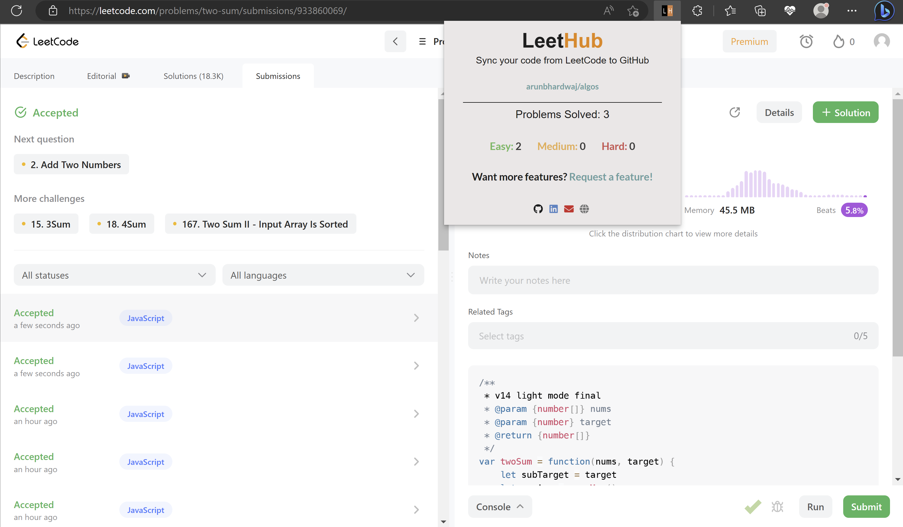

<h1 align="center">
  <a href="https://standardjs.com"></a>
  <br>
  <a href="https://chrome.google.com/webstore/detail/leethub-v2/mhanfgfagplhgemhjfeolkkdidbakocm">LeetHub v2</a> - Automatically sync your code to GitHub.
  <br>
  <br>
</h1>

<p align="center">
  <a href="https://github.com/arunbhardwaj/LeetHub-2.0/blob/main/LICENSE">
    
  </a>
  <!-- <a href="https://discord.gg/anXT9vErxu">
    
  </a> -->
  <!-- <a href="https://chrome.google.com/webstore/detail/leethub/aciombdipochlnkbpcbgdpjffcfdbggi">
    
  </a> -->
  <!-- <a href="https://chrome.google.com/webstore/detail/leethub/aciombdipochlnkbpcbgdpjffcfdbggi">
    
  </a>
  <a href="https://github.com/arunbhardwaj/LeetHub-1.1/graphs/contributors" alt="Contributors">
    
  </a> -->
</p>

<!-- <div align="center">
  <a href="https://www.producthunt.com/posts/leethub?utm_source=badge-featured&utm_medium=badge&utm_souce=badge-leethub" target="_blank">
    
  </a>

  [](https://chrome.google.com/webstore/detail/leethub/aciombdipochlnkbpcbgdpjffcfdbggi) [](https://addons.mozilla.org/en-US/firefox/addon/leethub/)
</div> -->

<!-- ## LeetHub progress and numbers (YouTube Video):
[](https://www.youtube.com/watch?v=o33PIjqlOgw "LeetHub saves lives!") -->

## What is LeetHub 2.0?
<p>A chrome extension that automatically pushes your code to GitHub when you pass all tests on a <a href="http://leetcode.com/">Leetcode</a> problem. It's forked from the original <a href="https://chrome.google.com/webstore/detail/leethub/aciombdipochlnkbpcbgdpjffcfdbggi?hl=en">LeetHub</a> and improves on it to be faster, cleaner and now works with the new LeetCode UI.</p>

### Why not merge with the original LeetHub?
<p>Recently, both LeetCode and GitHub made changes that broke the functionality of LeetHub. In order to fix these issues and get the extension working, I've had to make some extensive changes that fundamentally change the logic of the underlying code. Due to depth of the changes and the inactivity of the original repo, I've decided to fork, refactor and expand upon the original.</p>

## Why LeetHub?
<p> <strong>1.</strong> Recruiters <em>want</em> to see your contributions to the Open Source community, be it through side projects, solving algorithms/data-structures, or contributing to existing OS projects.<br>
As of now, GitHub is developers' #1 portfolio. LeetHub just makes it much easier (autonomous) to keep track of progress and contributions on the largest network of engineering community, GitHub.</p>

<p> <strong>2.</strong> There's no easy way of accessing your leetcode problems in one place! <br>
Moreover, pushing code manually to GitHub from Leetcode is very time consuming. So, why not just automate it entirely without spending a SINGLE additional second on it? </p>

## How does LeetHub work?     

<p>It's as simple as:</p>
<ol>
  <li>After installation, launch LeetHub.</li>
  <li>Click on "authorize with GitHub" button to automatically set up your account with LeetHub.</li>
  <li>Setup an existing/new repository with LeetHub (private by default) by clicking "Get Started" button.</li>
  <li>Begin Leetcoding! To view your progress, simply click on the extension!</li>
</ol>


#### BONUS: Star [this repository](https://github.com/arunbhardwaj/LeetHub-2.0) for further development of features. If you want a particular feature, simply [request](https://github.com/arunbhardwaj/LeetHub-2.0/labels/feature) for it!


## Why did I decide to work on LeetHub?
<p>
After the recent SVB bank closure and growing layoffs, it became clear to me that maintaining your skills is incredibly important. In that effort, it helps to have a source to contain all your learnings over the years: a repo you can go back to and see your commit history and any notes you've taken. With the previous and other extensions broken by recent LeetCode and GitHub changes, I decided to build one out myself using the original as a starting point.
</p>

# Let's see you ACE that coding interview!




# How to set up LeetHub for local development?

<ol>
  <li>Fork this repo and clone to your local machine</li>
  <li>Go to <a href="chrome://extensions">chrome://extensions</a> </li>
  <li>Enable <a href="https://www.mstoic.com/enable-developer-mode-in-chrome/">Developer mode</a> by toggling the switch on top right corner</li>
  <li>Click 'Load unpacked'</li>
  <li>Select the entire LeetHub folder</li>
  <li>Run "npm run setup" to install the developer dependencies</li>
</ol>

Other npm commands available:

```
npm run               Show list of commands available
npm run format        Auto-format JavaScript, HTML/CSS
npm run format-test   Test all code is formatted properly
npm run lint          Lint JavaScript
npm run lint-test     Test all code is linted properly
```
